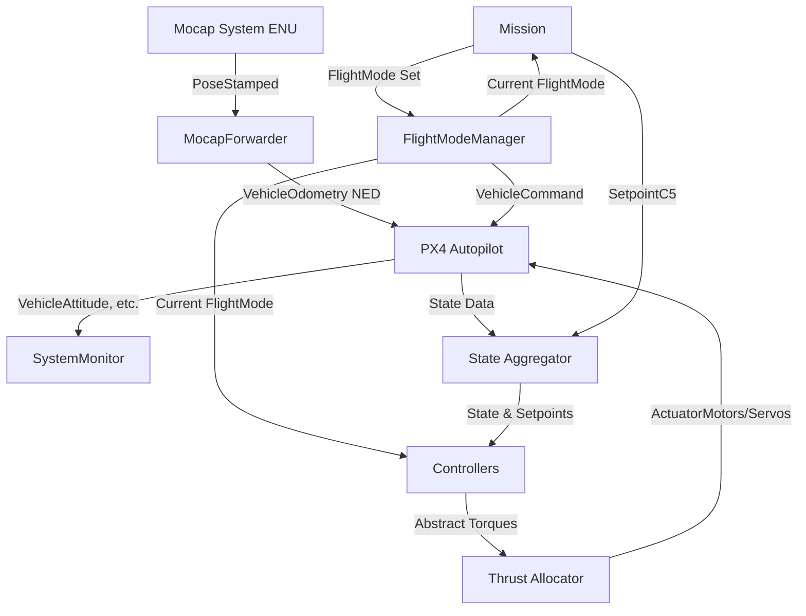

# E-Rocket Flight Software Architecture

This document provides a high-level overview of the ROS 2 node architecture and how the components interact with PX4 during a flight.

## Core Components

The system is composed of several ROS 2 nodes, each handling a specific part of the flight logic.

### 1. Mission (`mission.cpp`)
The `Mission` node acts as the brain of the autonomous flight. 
- **Slow Loop (1 Hz):** Manages high-level state transitions (e.g., from `INIT` to `PRE_ARM`, `ARM`, `TAKE_OFF`, `IN_MISSION`, `LANDING`, and finally `MISSION_COMPLETE`).
- **Fast Loop (100 Hz):** Continuously checks the emergency switch and generates mathematical setpoint trajectories (Position, Velocity, Acceleration, Jerk, Snap) for takeoff, mission, and landing phases. It outputs `SetpointC5` messages.

### 2. Controllers (`baseline_pid_controller.cpp`, `controller_generic.cpp`)
These nodes are responsible for tracking the trajectory provided by the `Mission` node.
- **Baseline PID Controller:** Runs at a steady 50 Hz. It decouples network IO from mathematical calculations using `StateAggregator` and `SetpointAggregator`. It consists of a `PositionPIDController` (outer loop) and an `AttitudePIDController` (inner loop). It computes necessary torques and forces, and hands them off to the `Allocator`.
- **Generic Controller:** A placeholder/template node allowing users to implement custom control algorithms using the same aggregator/allocator framework.

### 3. Allocator (`allocator.hpp`)
The allocator takes abstract forces/torques computed by the controllers and maps them to physical actuator commands (e.g., Thrust Vectoring servo angles and motor PWM values). It factors in the physical limitations of the servos (like maximum tilt angle).

### 4. Flight Mode Manager (`flight_mode.cpp`)
This node is the primary bridge between the custom ROS 2 logic and the PX4 Autopilot state machine.
- It translates abstract flight modes (e.g., `PRE_ARM`) into concrete MAVLink `VehicleCommand` requests to PX4 (e.g., `VEHICLE_CMD_DO_SET_MODE` to Offboard).
- It constantly publishes the current flight mode for other nodes to consume.

### 5. Motion Capture Forwarder (`mocap_forwarder.cpp`)
During indoor testing, a Motion Capture system (like VRPN) tracks the rocket's pose.
- Receives pose data in the ROS 2 standard **ENU** (East-North-Up) frame.
- Transforms the pose to the PX4 standard **NED** (North-East-Down) frame using routines in `lib/frame_transforms.cpp`.
- Publishes the transformed pose as `VehicleOdometry` to be consumed by the PX4 Extended Kalman Filter (EKF).

### 6. System Monitor (`system_monitor.cpp`)
A safety-critical background node that tracks the health of all incoming and outgoing messages.
- Monitors message frequencies, latencies, and dropped packets.
- Triggers warnings if any critical topic goes stale or falls below the expected publishing rate (e.g., PX4 attitude data dropping below 100 Hz).

## Data Flow Diagram

